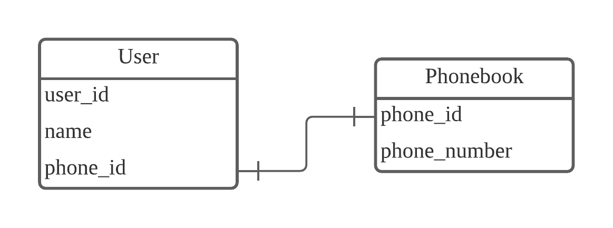

# 관계형 DB(Relational DataBase)
### 각 테이블간의 relation을 나타내는 것으로
### 1:1 / 1:N / N:M 방식이 있으며 테이블을 어떻게 활용하는지에 따라 결정할 수 있다.
-------------------------------------------------

### [ 1:1 관계 ]
### 1개의 컬럼이 다른 테이블의 컬럼 1개와 연결된 경우

### 1명의 User는 1개의 전화번호를 가질 수 있다.
------------------------------------------------------------

### [ 1:N 관계 ]
### 1개의 컬럼이 서로 다른 여러개의 컬럼과 연결된 경우

### 1명의 User는 여러개의 전화번호를 가질 수 있지만
### 여러명의 User가 1개의 전화번호를 가질 수 없다.
------------------------------------------------------------

### [ N:M 관계 ]
### 여러개의 컬럼이 다른 테이블의 여러개의 컬럼과 연결된 경우
### 관리 테이블을 추가하여 연결할 수 있음

### 1명의 Customer는 여러개의 상품을 구매할 수 있고
### 여행 상품 1개는 여러명의 Customer가 구매할 수 있다.
### customer_package 테이블은 customer_id와 package_id를 묶어주는 역할
------------------------------------------------------------

# SQL JOIN
### 둘 이상의 테이블을 연결해서 데이터를 검색하는 방법
### 서로 연결하기 위해서는 적어도 하나의 컬럼을 공유하고 있어야 한다.


### [ LEFT OUTER JOIN ]
### 왼쪽 테이블이 기준이 되며 기준 테이블은 모든 데이터가 조회되고
### 오른쪽 테이블과 일치하지 않는 부분은 NULL이 채워짐
```
SELECT 컬럼 FROM 기준테이블 LEFT OUTER JOIN 상대테이블 ON 조건문
```
------------------------------------------------------------

### [ RIGHT OUTER JOIN ]
### 오른쪽 테이블이 기준이 되며 기준 테이블은 모든 데이터가 조회되고
### 왼쪽 테이블과 일치하지 않는 부분은 NULL이 채워짐
```
SELECT 컬럼 FROM 상태테이블 RIGHT OUTER JOIN 기준테이블 ON 조건문
```
------------------------------------------------------------

### [INNER JOIN ]
### 양 테이블 모두 데이터가 존재하는 경우 조회됨
```
SELECT 컬럼 FROM 테이블1, 테이블2
```